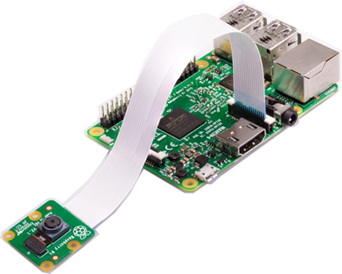

# Raspberry Pi -- Camera 2.1

[The Cam](https://www.raspberrypi.org/products/camera-module-v2/).

- Sony IMX219 Exmor R back-illuminated 8-megapixel sensor
- 1080p30, 720p60 and VGA90
- CSI bus, MMAL and V4L APIs
- Made by [Element 14](https://www.element14.com/)
- [Getting Started with the Pi-Camera](https://www.element14.com/community/docs/DOC-65138/l/getting-started-with-the-pi-camera-instructions)

- The First image taken using `raspistill -o pic1.jpg` (protective film hasn't been removed):  

- The First video taken using `raspivid -o vid1.h264`: [The First Video Taken](img/vid1.h264), 9MB.

## System Tools

- [Configuration tool for the Raspberry Pi](https://github.com/RPi-Distro/raspi-config)
- [element14/Raspberry Pi Project](https://github.com/element14/pi_project)

## Video Handling

- `git clone` [git://source.ffmpeg.org/ffmpeg.git](git://source.ffmpeg.org/ffmpeg.git)
  - `cd ffmpeg`
  - `./configure --arch=armel --target-os=linux --enable-gpl --enable-nonfree --enable-libx264 --enable-libmp3lame`
  - `make -j$(nproc)`
  - `sudo make install`
- `git clone` [git://git.videolan.org/x264](git://git.videolan.org/x264)
  - `cd x264`
  - `./configure --host=arm-unknown-linux-gnueabi --enable-static --disable-opencl`
  - `make -j$(nproc)`
  - `sudo make install`
- [HOWTO - Create a Raspberry Pi IP Camera with RTSP server](https://random-notes-of-a-sysadmin.blogspot.ru/2015/05/howto-create-raspberry-pi-ip-camera.html) using **live555** libs.
  - Ends in `raspivid -t 0 -fps 30 -g 1 -b 2000000 -h 1920 -w 1080 -o - | ./testRaspi`.
  - grab and unpack http://www.live555.com/liveMedia/public/live555-latest.tar.gz
  - `sed -i 's/-D_FILE_OFFSET_BITS=64/& -DALLOW_RTSP_SERVER_PORT_REUSE=1/' ./config.linux && ./genMakefiles linux && make`
  - grab and unpack https://www.raspberrypi.org/forums/download/file.php?id=4285
  - `sed -i 's%\.\./%&live/%g' Makefile #` as it goes there :)
  - fix `OutPacketBuffer::maxSize` (yep, just add into the `main`) to something working...
  - `make` it

## Assorted TFMs

- [picamera](http://picamera.readthedocs.io/) Python APIs and other stuff worth to read.

## BTW

- **Raspberry Pi** -- The R-Pi is the single board computer at the heart of
this project.  This project will work on both Model A and B versions.
- **Pi-Camera** -- The Raspberry Pi Camera Module is a custom designed add-on
for R-Pi. It attaches to R-Pi by way of one of the two small sockets on the
board upper surface. This interface uses the dedicated CSI bus, which was
designed especially for interfacing to cameras. The CSI bus is capable of
extremely high data rates, and it exclusively carries pixel data.  The board
itself is tiny, at around 25mm x 20mm x 9mm. It also weighs just over 3g, making
it perfect for mobile or other applications where size and weight are important.
It connects to R-Pi by way of a short ribbon cable. The camera is connected to
the BCM2835 processor on the R-Pi via the CSI bus, a higher bandwidth link that
carries pixel data from the camera back to the processor. This bus travels along
the ribbon cable that attaches the camera board to the R-Pi. The sensor itself
has a native resolution of 5 megapixel, and has a fixed focus lens onboard. In
terms of still images, the camera is capable of 2592 x 1944 pixel static images,
and also supports 1080p30, 720p60 and 640x480p60/90 video.
- **CSI bus** -- The Camera Serial Interface (CSI) Bus is used to enable the
R-Pi processor to use an external digital camera. Connection to the CSI bus
is via a 15-way 'flat-flex' connector on the R-Pi that provides a MIPI CSI-2
hardware interface for a digital camera (used for stills or video).
- **raspistill** -- The R-Pi application, available as part of the latest
Raspbian O/S, that can be used to obtain still images from a Pi-Camera connected
to the R-Pi via the CSI bus.
- **raspivid** -- The R-Pi application, available as part of the latest Raspbian
O/S, that can be used to obtain videos from an external Pi-Camera connected to
the R-Pi via the CSI bus..

# EOF #
