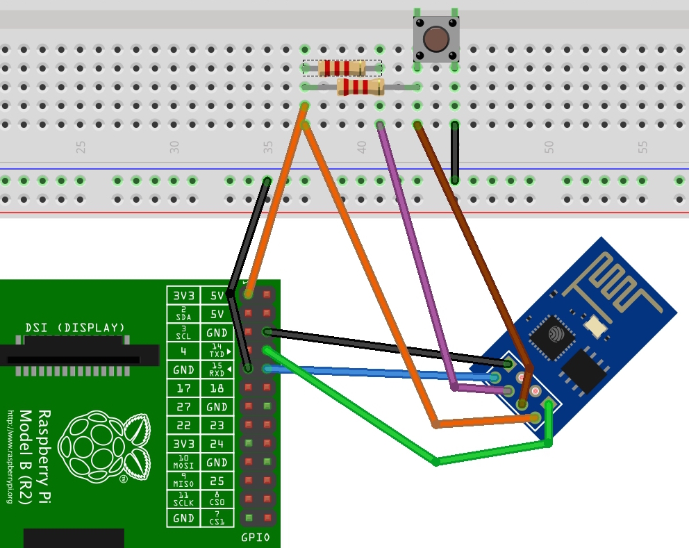

# Raspberry Pi ESP8266 GPIO (SDIO) Fi-Fi

- [ESP8266 is actually a ESP8089](https://oshlab.com/esp8266-raspberry-pi-gpio-wifi/)  
If you do not pull down GPIO 15 on boot, as you would when running it as a microcontroller,
it runs in SDIO mode and is basically an ESP8089 IC at that point.

```bash
cd ~
git clone https://github.com/oshlab/esp8089.git
cd esp8089
sudo sh install
sudo reboot
# ...
sudo iwlist scan
```

- [Newer approach](http://www.instructables.com/id/Connect-an-ESP8266-to-your-RaspberryPi/)  

  - edit `/boot/cmdline.txt` as `sed -e 's/console=ttyAMA0,115200//' -e 's/kgdboc=ttyAMA0,115200//' -i /boot/cmdline.txt`
  - edit `/etc/inittab` to remove `2:23:respawn:/sbin/getty -L ttyAMA0 115200 vt100`
  - reboot
  - run `screen /dev/ttyAMA0 115200` or `minicom -b 115200 -o -D /dev/ttyAMA0` to play (say, `AT+RST` or [`AT+CWJAP="ssid","password"`](http://www.extragsm.com/blog/2014/12/03/connect-esp8266-to-raspberry-pi/))

# EOF #
